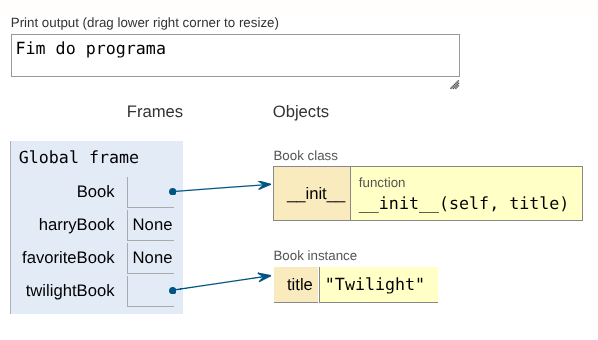
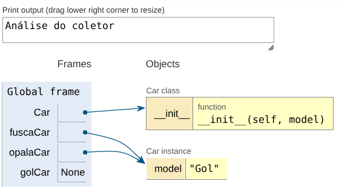
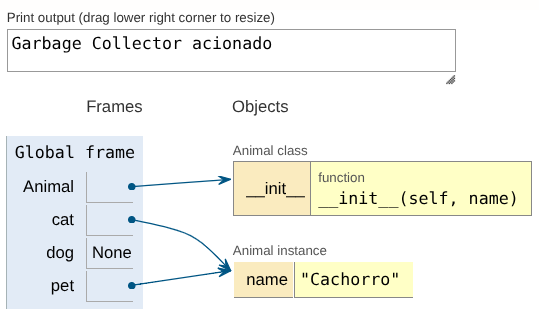
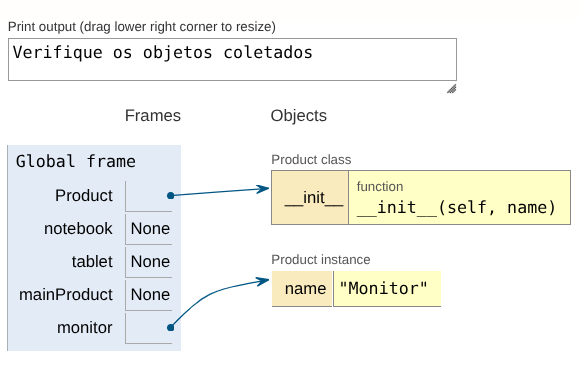
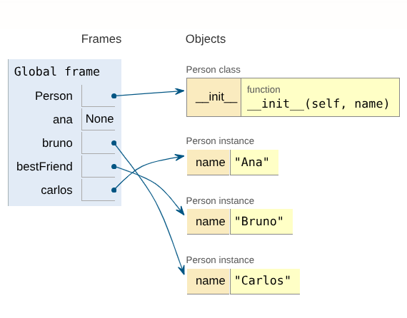

# estrutura_dados_2026

## Aula 2026-08-06 
### Introdução
* [Material 01](./2026-08-06/untitled.py)
* [Material 02](./2026-08-06/Exercicios_Coletor_de_Lixo_Python_Nomes_Intuitivos.py)

Respostas

* Resposta 1

* Resposta 2

* Resposta 3

* Resposta 4

* Resposta 5

## Aula 2026-08-13
### Inicializador
* [Material 01](./2026-08-13/inicializador.py)

